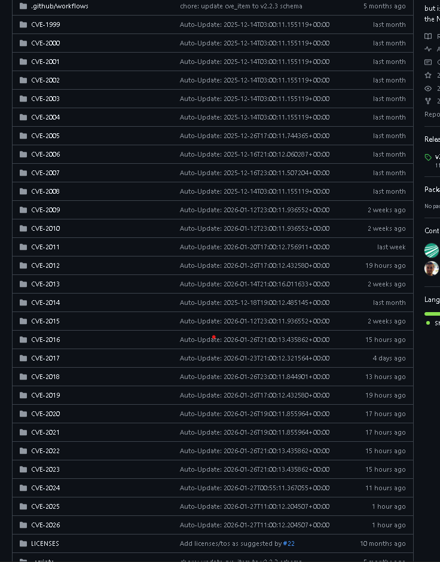

# 5. API NVD (NIST)

## 5.1 Objectif de cette section
Cette section documente l’accès aux données NVD via l’API officielle du NIST afin de permettre :
- la récupération automatisée des CVE (ingestion initiale et incrémentale),
- l’intégration des données NVD dans un pipeline (ETL/ELT, data lake),
- la consommation dans des outils sécurité (SOC/SIEM, dashboards, vuln management).

---

## 5.2 Présentation générale
La NVD fournit une API REST permettant de récupérer les informations CVE enrichies au format JSON.

L’API permet notamment :
- recherche par identifiant CVE,
- filtres par dates de publication / modification,
- récupération par mots clés,
- pagination des résultats,
- utilisation d’une API Key pour améliorer les quotas et performances.

---

## 5.3 Endpoints principaux
### 5.3.1 CVE (vulnérabilités)
Endpoint principal pour interroger les CVE :

- **CVE API v2.0** : récupération des données vulnérabilités

Ce endpoint est le plus utilisé pour :
- ingestion complète (par année ou par fenêtres de temps),
- ingestion incrémentale via `lastModified`,
- lookup direct d’une CVE.

Exemple :
- requête par CVE ID
- requête filtrée par période (published / lastModified)

---

### 5.3.2 Change History (historique)
Un endpoint peut être utilisé pour suivre les changements appliqués aux CVE.

Cas d’usage :
- détecter qu’un score CVSS a changé,
- vérifier la date et la nature de mise à jour,
- fiabiliser les pipelines incrémentaux.

Exemple :
- requête d’historique sur une CVE
- requête d’historique dans une fenêtre de temps

---

## 5.4 Paramètres de requête (filtres)
Les endpoints supportent des filtres permettant de limiter les résultats.

### 5.4.1 Filtres les plus utilisés
- identifiant CVE :
  - recherche d’une CVE spécifique (`CVE-YYYY-NNNN`)
- mots clés :
  - recherche textuelle dans la description / métadonnées
- dates :
  - `pubStartDate` / `pubEndDate` (publication)
  - `lastModStartDate` / `lastModEndDate` (modification)

✅ Bonnes pratiques :
- privilégier les filtres `lastModified` pour une ingestion incrémentale fiable
- utiliser des fenêtres de temps (ex : dernières 2h / 24h) pour limiter le volume

---

## 5.5 Pagination et limites
### 5.5.1 Pagination
La plupart des requêtes retournent une liste paginée.
On retrouve généralement :
- un indicateur de position (ex : `startIndex`)
- une taille de page (ex : `resultsPerPage`)
- un total (ex : `totalResults`)

✅ Bonnes pratiques :
- implémenter une boucle de pagination jusqu’à récupération complète des résultats
- conserver l’état de synchronisation (offset / date max)

---

### 5.5.2 Limites (rate limit)
L’API NVD applique des restrictions de débit (rate limiting) et des limites de volumes.

⚠️ Points importants :
- trop d’appels rapprochés peuvent provoquer des erreurs ou un throttling
- une ingestion complète doit être faite avec des stratégies de backoff et retry

✅ Bonnes pratiques :
- limiter le parallélisme
- utiliser retry avec backoff exponentiel
- utiliser cache / persistance locale

---

## 5.6 Authentification via API Key
La NVD propose une authentification via **API Key**.

Objectifs :
- amélioration des quotas (plus de requêtes possibles)
- meilleure stabilité (moins de throttling)

✅ Bonnes pratiques :
- stocker la clé dans un secret manager (Vault, AWS Secret Manager, etc.)
- ne jamais committer la clé dans Git
- rotation régulière
- monitorer l’utilisation
- https://nvd.nist.gov/developers/request-an-api-key
---

## 5.7 Exemples de requêtes (recommandés)
Les exemples suivants sont recommandés pour une documentation technique complète :

### 5.7.1 Récupérer une CVE précise
Exemple : requête directe sur un identifiant CVE

### 5.7.2 Synchronisation incrémentale par fenêtre `lastModified`
Exemple : récupérer toutes les CVE modifiées depuis X heures

### 5.7.3 Synchronisation par période de publication
Exemple : récupérer toutes les CVE publiées sur un intervalle (utile pour import initial)

### 5.7.4 Pagination
Exemple : extraction paginée (page 1 → page N)

### 5.7.5 Requête filtrée + mots clés
Exemple : recherche d’un produit/éditeur par keyword

---

## 5.8 Recommandations d’intégration (pipeline)
Pour intégrer l’API efficacement :

1. **Import initial**
   - ingestion par périodes (ex : par année / par trimestre)
2. **Mode incrémental**
   - ingestion régulière (ex : toutes les 2h / quotidien)
   - basé sur `lastModified`
3. **Normalisation**
   - conversion vers un modèle interne unique (CVE + CVSS + CWE + CPE)
4. **Stockage**
   - conserver la CVE brute JSON + une version transformée (modèle interne)
5. **Observabilité**
   - logs + métriques (volume, erreurs rate limit, temps ingestion)
### 5.9 Alternative : miroir GitHub des Data Feeds NVD
En complément de l’API officielle, il existe un dépôt GitHub communautaire qui reconstruit et synchronise les anciens **JSON NVD Data Feeds**.

- Repository : `fkie-cad/nvd-json-data-feeds`
- Lien : https://github.com/fkie-cad/nvd-json-data-feeds

- 
- Ce dépôt :
- publie des données CVE structurées par années (`CVE-1999`, `CVE-2000`, etc.),
- propose des mises à jour régulières (notamment une publication quotidienne autour de 00:00 UTC),
- synchronise les données sur la base des mêmes sources NVD (NIST).

✅ Cas d’usage :
- ingestion simplifiée via GitHub (clone / release / snapshots),
- récupération rapide d’un historique complet par années,
- alternative pratique pour tests/pipelines.

⚠️ Points de vigilance :
- il ne s’agit pas d’une source officielle NIST,
- la source de référence (“authoritative source”) reste l’API NVD / les feeds NVD officiels.
